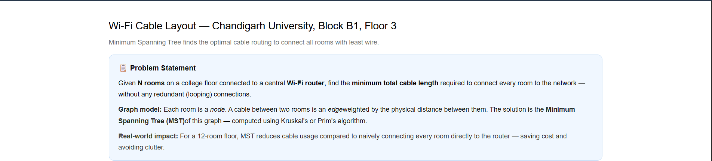
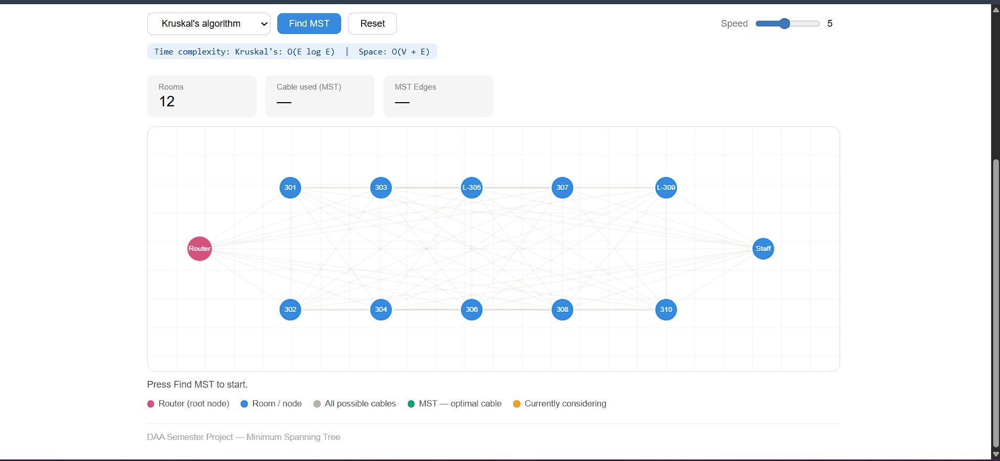
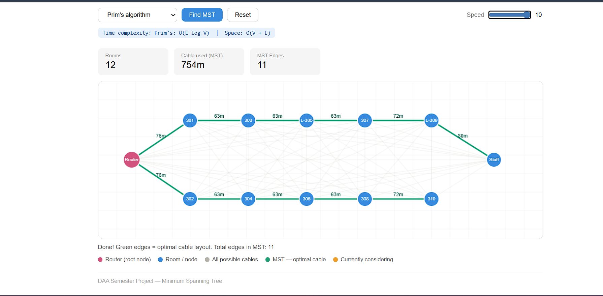

# 📡 Wi-Fi Cable Layout — Minimum Spanning Tree Visualizer

> **DAA Semester Project** -  **Live Demo:** [mst-wifi-layout.vercel.app](https://mst-wifi-layout.vercel.app)
 

---

## 📋 Problem Statement

Given **N rooms** on a college floor connected to a central **Wi-Fi router**, find the **minimum total cable length** required to connect every room to the network — without any redundant (looping) connections.

**Graph model:** Each room is a *node*. A cable between two rooms is an *edge* weighted by the physical distance between them. The solution is the **Minimum Spanning Tree (MST)** of this graph — computed using Kruskal's or Prim's algorithm.

**Real-world impact:** For a 12-room floor, MST eliminates redundant cable runs, saving cost and avoiding clutter compared to connecting every room directly to the router.

---

## 🖼️ Screenshots

### Initial State — Floor Plan


### After Running Kruskal's Algorithm


### After Running Prim's Algorithm


---

## ✨ Features

- **Live animation** — watch the algorithm consider and accept/reject edges in real time
- **Two algorithms** — switch between Kruskal's and Prim's with one click
- **Speed control** — adjust animation speed from slow (for explanation) to fast (for demo)
- **Stats panel** — shows total rooms, cable length used, and MST edge count
- **Time complexity badge** — updates dynamically when you switch algorithms
- **Color-coded visualization:**
  - 🔴 Router — root node (source of Wi-Fi)
  - 🔵 Rooms — regular nodes
  - ⚪ Grey edges — all possible cable routes
  - 🟢 Green edges — MST optimal cable layout
  - 🟡 Orange edge — currently being considered by the algorithm

---

## 🧠 Algorithms Implemented

### Kruskal's Algorithm — `O(E log E)`
1. Calculate distance between every pair of rooms → build all edges with weights
2. Sort all edges by weight (shortest first)
3. Pick edges one by one — add an edge only if it doesn't form a cycle
4. Cycle detection uses **Union-Find (Disjoint Set Union)** with path compression
5. Stop when N-1 edges are selected

### Prim's Algorithm — `O(E log V)`
1. Start from the Router node
2. At each step, look at all edges going from the connected set to an unconnected room
3. Pick the shortest one and add that room to the MST
4. Repeat until all rooms are connected

---

## 🗂️ Project Structure

```
src/
├── components/
│   ├── Canvas.js        ← draws nodes, edges, animation on HTML canvas
│   ├── Controls.js      ← algorithm selector, Find MST, Reset, Speed
│   └── StatsBar.js      ← rooms count, cable used, MST edges
├── algorithms/
│   ├── kruskal.js       ← returns animation steps for Kruskal's
│   ├── prim.js          ← returns animation steps for Prim's
│   └── unionFind.js     ← Union-Find with path compression & rank
├── utils/
│   └── geometry.js      ← euclidean distance, edge builder
└── App.js               ← main component, state, animation loop
```

---

## 🏫 Floor Layout

Single-corridor floor plan modelled on Block B1, Floor 3:

```
[Router] — 301 — 303 — L-305 — 307 — L-309
                                         |
         — 302 — 304 —  306  — 308 — 310 — [Staff]
```

- **Top row (odd):** 301, 303, L-305 (Lab), 307, L-309 (Lab)
- **Bottom row (even):** 302, 304, 306, 308, 310
- **Endpoints:** Router (left), Staff Room (right)
- **12 nodes total → MST uses exactly 11 edges**

---

## 🚀 Getting Started

### Prerequisites
- Node.js v16+
- npm

### Installation

```bash
git clone https://github.com/your-username/mst-wifi-layout.git
cd mst-wifi-layout
npm install
npm start
```

Open [http://localhost:3000](http://localhost:3000) in your browser.

### Build for production

```bash
npm run build
```

---

## 🛠️ Tech Stack

- **React.js** — UI and state management
- **HTML Canvas API** — graph rendering and animation
- **Vanilla JavaScript** — all algorithm logic (no external libraries)

---

## 📊 Complexity Summary

| Algorithm | Time | Space |
|-----------|------|-------|
| Kruskal's | O(E log E) | O(V + E) |
| Prim's | O(E log V) | O(V + E) |
| Union-Find (with path compression) | O(α(V)) per operation | O(V) |

Where V = vertices (rooms), E = edges (possible cable connections), α = inverse Ackermann function (practically constant).

---

## 📁 Key Files Explained

| File | Purpose |
|------|---------|
| `unionFind.js` | Core of Kruskal's — tracks which rooms are already connected to prevent cycles |
| `geometry.js` | Calculates Euclidean distance between room coordinates, builds edge list |
| `kruskal.js` | Returns step-by-step animation snapshots for Kruskal's traversal |
| `prim.js` | Returns step-by-step animation snapshots for Prim's traversal |
| `Canvas.js` | Renders everything on `<canvas>` — grid, edges, nodes, labels, weights |
| `App.js` | Orchestrates state, runs animation loop with `setTimeout` |

---
